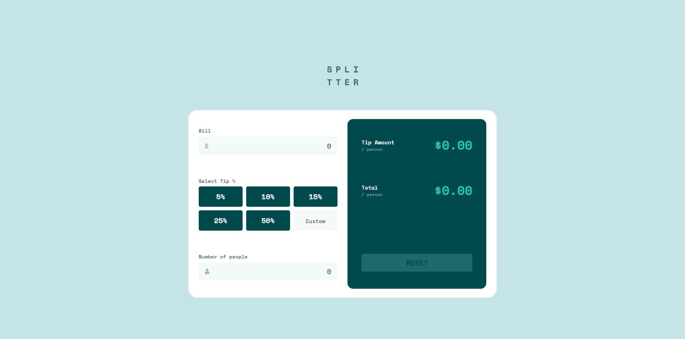

# Tip calculator app

This is a solution to the [Tip calculator app challenge on Frontend Mentor](https://www.frontendmentor.io/challenges/tip-calculator-app-ugJNGbJUX). 

##  The challenge

Users should be able to:

- View the optimal layout for the app depending on their device's screen size
- See hover states for all interactive elements on the page
- Calculate the correct tip and total cost of the bill per person

## Links

- Live Site URL: [Tip Calculator](https://ariferreira.com/tip-calculator)
- Repository URL: [Tip Calculator](https://github.com/fumigari/tip-calculator)

## Built with

- Semantic HTML5 markup
- CSS custom properties
- CSS Grid
- JavaScript

## Author

- Website - [Ari Ferreira](https://ariferreira.com)
- GitHub - [@fumigari](https://github.com/fumigari)

## Acknowledgments

Special thanks to Frontend Mentor for providing such an amazing platform to practice and improve my frontend skills.

